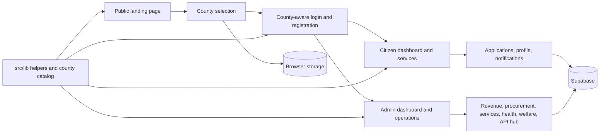

# CountyConnect SaaS

CountyConnect is a white-label county government platform for Kenya. It is designed to digitize permit applications, payments, service delivery, revenue collection, public engagement, and administrative oversight in one county-aware system.

The current repository is a React and Supabase MVP. It focuses on realistic user journeys, county-specific pricing and login, operational dashboards for citizens and county staff, and Supabase-backed auth, profiles, applications, service data, storage, and Edge Functions.

## Executive Summary

CountyConnect is a county-aware civic operations platform built to help Kenyan county governments digitize citizen services, revenue collection, and internal administration.

It is designed to:

- Present county-specific pricing and login flows
- Give citizens one place to apply, pay, track, and engage
- Give county teams one place to review, manage, and report
- Feel realistic in demos while using Supabase for the core persistence layer
- Scale from a small county rollout to a broader multi-county deployment

## What this system is about

CountyConnect exists to help county governments move away from paper-heavy service delivery and fragmented spreadsheets. The platform gives counties a single digital front door for citizens, businesses, and internal teams.

At a high level, it helps with:

- Online permit and license applications
- County-specific onboarding and login
- Revenue and payment workflows
- Service catalog management
- Citizen notifications and engagement
- Application review and approval flows
- Executive reporting and transparency
- Department, procurement, health, welfare, and API operations

The product is built around the reality of devolved government: each county has its own priorities, rollout cost, and operating context. That is why the landing page includes county-aware pricing and the login flow is bound to the selected county.

## Who it is for

- Citizens who need to apply for county services and track progress
- Business owners who need licenses, permits, or compliance support
- County administrators who review applications and manage services
- Executive teams that need revenue visibility and policy oversight
- County IT teams that want a branded, expandable digital service portal

## Core experiences

### Citizen experience

- County-aware login and registration
- Service catalog browsing
- Guided application submission
- Dashboard overview with notifications and status updates
- Citizen profile editing
- Tax compliance, land registry, welfare, and public engagement entry points

### County admin experience

- Executive dashboard and analytics
- Application review queue
- Department management
- Service catalog management
- County settings
- Revenue collection workflows
- Procurement visibility
- Public health and social welfare operations
- API hub for integration-facing administration

### County-aware pricing and rollout

The landing page ships with a county catalog and a tiered pricing model. Counties are grouped into rollout tiers such as metro, growth, and access, with packages that adapt to the county profile selected by the user.

This lets the platform present a realistic procurement story for different county sizes and rollout phases, instead of forcing one flat price across every county.

## How it works

The application behaves like a single-page government portal:

1. The public landing page introduces the platform and shows county-specific pricing.
2. Users choose a county, and that selection is persisted in browser storage.
3. Citizens and admins enter through role-aware login routes.
4. Dashboards and forms reuse the selected county so the experience stays consistent.
5. Profiles, applications, services, departments, notifications, and dashboards read from Supabase tables through RLS-protected APIs.

Some specialized vertical workflows still include simulated integration states so the UI reads like a real government workflow while external integrations are phased in.

## Tech stack

- React 19
- TypeScript 5.8
- Vite 6
- Tailwind CSS 4
- React Router DOM 7.13
- Supabase Auth, Database, Storage, and Edge Functions
- Motion
- Recharts
- Lucide React

## Project structure

- `src/pages/` contains the public pages, citizen views, admin views, and form flows
- `src/components/` contains shared layout components such as the dashboard shell
- `src/lib/` contains shared helpers, Supabase mutations, typed data hooks, and data models
- `supabase/migrations/` contains database schema, RLS policies, grants, and storage setup
- `supabase/functions/` contains Supabase Edge Functions such as M-Pesa STK push and webhook handlers
- `src/App.tsx` defines the routing map for the full experience

## Main routes

| Route | Purpose |
| --- | --- |
| `/` | Public landing page with the product story and county pricing |
| `/login` | County-aware login for citizens and admins |
| `/register` | County-aware account creation |
| `/dashboard` | Citizen dashboard |
| `/applications/new` | Service catalog for starting a new application |
| `/apply/:serviceId` | Guided application form |
| `/tax-compliance` | Citizen tax compliance workflow |
| `/land-registry` | Land-related workflow |
| `/social-welfare` | Welfare services and benefits workflow |
| `/engagement` | Public participation and citizen feedback |
| `/profile` | Citizen profile management |
| `/notifications` | Citizen notifications inbox |
| `/admin` | County admin dashboard |
| `/admin/analytics` | Executive analytics |
| `/admin/applications` | Application queue |
| `/admin/applications/:id` | Application review details |
| `/admin/services` | Service catalog management |
| `/admin/departments` | Department management |
| `/admin/settings` | County settings |
| `/admin/procurement` | Procurement dashboard |
| `/admin/revenue` | Revenue collection dashboard |
| `/admin/welfare` | Welfare operations |
| `/admin/health` | Public health operations |
| `/admin/api-hub` | API and integration hub |

## Architecture

CountyConnect is organized as a Vite front-end with Supabase as the persistence and auth layer.



### Key screen groups

- Public marketing and county pricing on the landing page
- Role-based authentication for citizens and administrators
- Citizen workflows for services, applications, tax compliance, land, welfare, and engagement
- Admin workflows for applications, analytics, services, departments, settings, procurement, revenue, health, and APIs

## Supabase Setup

Create a Supabase project, then apply the migrations in `supabase/migrations/`. The schema enables RLS and expects admin access to come from `public.profiles.role` with `admin` or `super_admin`.

Required Vite environment variables:

```bash
VITE_SUPABASE_URL="https://your-project-ref.supabase.co"
VITE_SUPABASE_PUBLISHABLE_KEY="your-supabase-publishable-key"
```

Required Edge Function secrets for M-Pesa:

```bash
APP_URL="https://your-project-ref.supabase.co"
DARAJA_CONSUMER_KEY=""
DARAJA_CONSUMER_SECRET=""
DARAJA_PASSKEY=""
DARAJA_SHORTCODE=""
DARAJA_ENV="sandbox"
```

The M-Pesa secrets must be stored as Supabase Edge Function secrets, not committed to source control.

## Deployment and Environment

The current build is meant to run as a browser-based Vite app backed by Supabase.

- Development server: `npm run dev`
- Production build: `npm run build`
- Production preview: `npm run preview`
- TypeScript validation: `npm run lint`

Runtime configuration is required through `VITE_SUPABASE_URL` and `VITE_SUPABASE_PUBLISHABLE_KEY`.

The app still persists county selection in browser storage, while account, profile, application, dashboard, and storage workflows use Supabase.

## Getting started

### Prerequisites

- Node.js 18 or newer
- npm

### Install dependencies

```bash
npm install
```

### Start the development server

```bash
npm run dev
```

The app runs on port 3000.

### Build for production

```bash
npm run build
```

### Run the TypeScript check

```bash
npm run lint
```

### Preview the production build

```bash
npm run preview
```

## Current implementation notes

- Supabase is now the backend for auth, profiles, application submission, storage, service data, and core dashboard reads.
- County selection still persists in browser storage and should move onto the user profile for production multi-county rollout.
- Some vertical workflows and external integrations remain simulated or partially wired, including OAuth provider alerts, final payment reconciliation, and some document review views.
- Admin authorization is based on `profiles.role`; seed or assign `admin` / `super_admin` deliberately before using admin routes.

## Why this matters

County governments need software that is trustworthy, county-aware, and easy to adopt. CountyConnect is meant to provide that operating layer: one place for citizens to apply, pay, track, and engage, and one place for county teams to manage service delivery, oversight, and revenue.

In short, it is a civic operating system for county government services.

